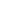
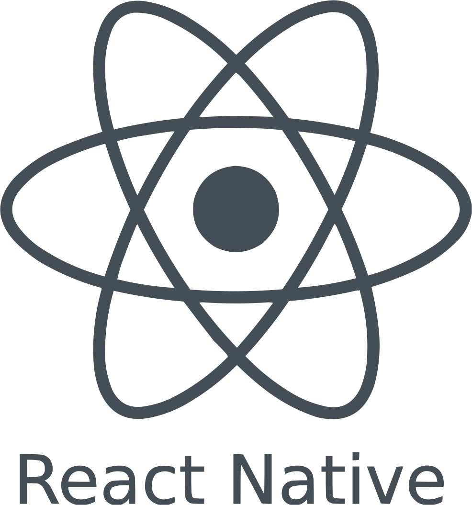
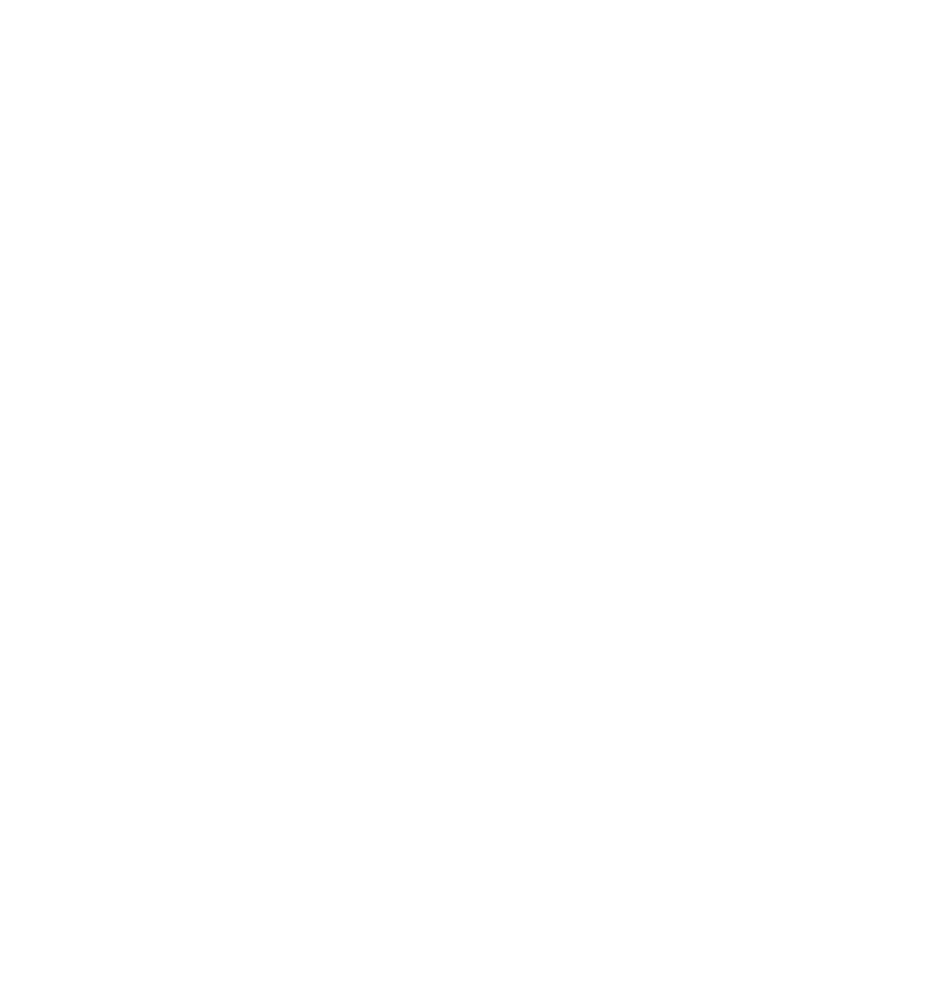

# Hi there, I'm Alex - aka drugsosos 👋

## Automation and manual QA

- 🔭 I’m currently working on LIIS
- 🌱 I’m currently learning everything 🐸
- 👯 I’m looking to collaborate with other 🐍Python devs

Connect with me:
---

&nbsp;&nbsp;

Languages and Tools:
---

&nbsp;&nbsp;

&nbsp;&nbsp;

&nbsp;&nbsp;

&nbsp;&nbsp;

&nbsp;&nbsp;

Frameworks worked w/:
---

&nbsp;&nbsp;

---

  
:zap: Recent GitHub Activity

  &nbsp;
  
<!--START_SECTION:activity-->
1. 🗣 Commented on [#1075](https://github.com/elebumm/RedditVideoMakerBot/issues/1075) in [elebumm/RedditVideoMakerBot](https://github.com/elebumm/RedditVideoMakerBot)
2. 🗣 Commented on [#1069](https://github.com/elebumm/RedditVideoMakerBot/issues/1069) in [elebumm/RedditVideoMakerBot](https://github.com/elebumm/RedditVideoMakerBot)
<!--END_SECTION:activity-->

  
:zap: GitHub Stats

  &nbsp;
  
  
  
  
  

